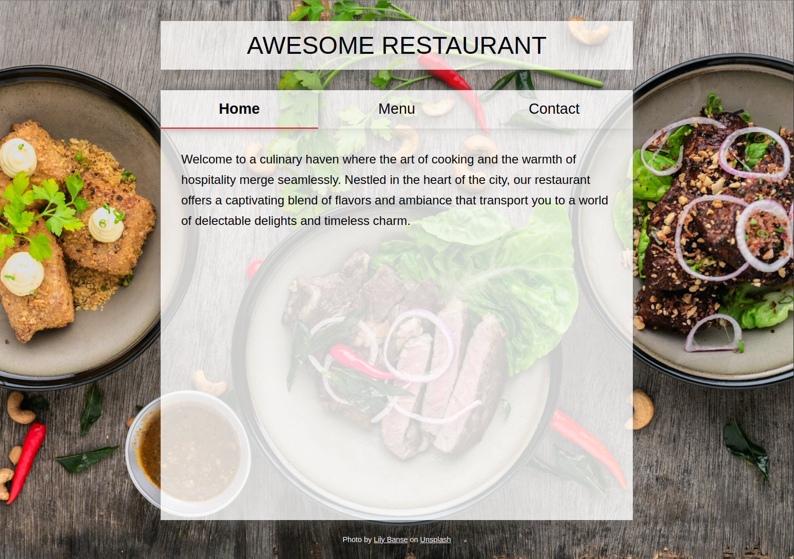
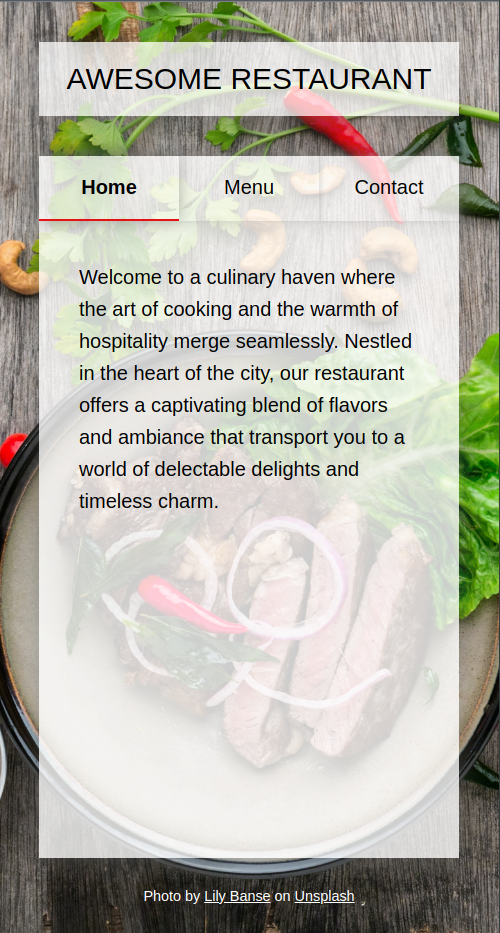

# Project "Restaurant Page"

## Task Description
Create a simple restaurant homepage using webpack - a tool for bundling JavaScript modules.

Set up your restaurant site to use tabbed browsing to access Home, Menu, and Contact pages. Put the contents of each tab inside of its own module.

## Final Version

In a regular browser:

 

In a mobile browser:

